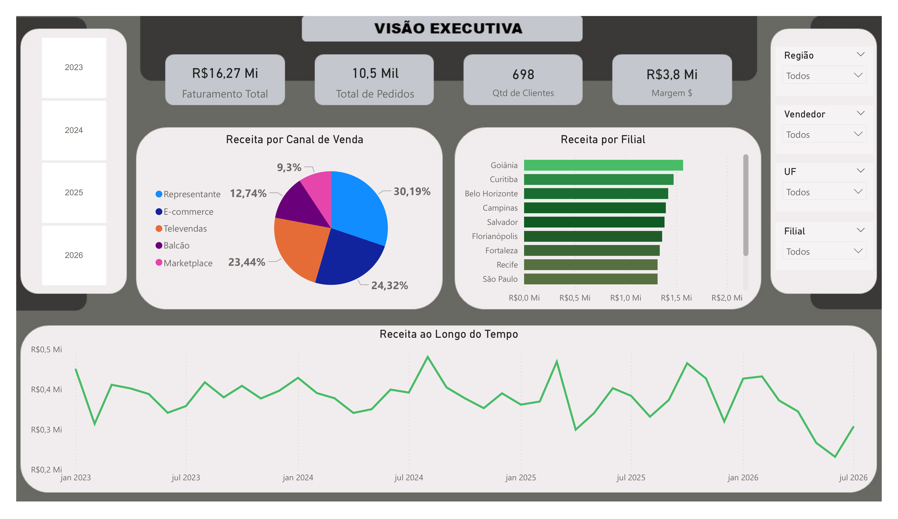
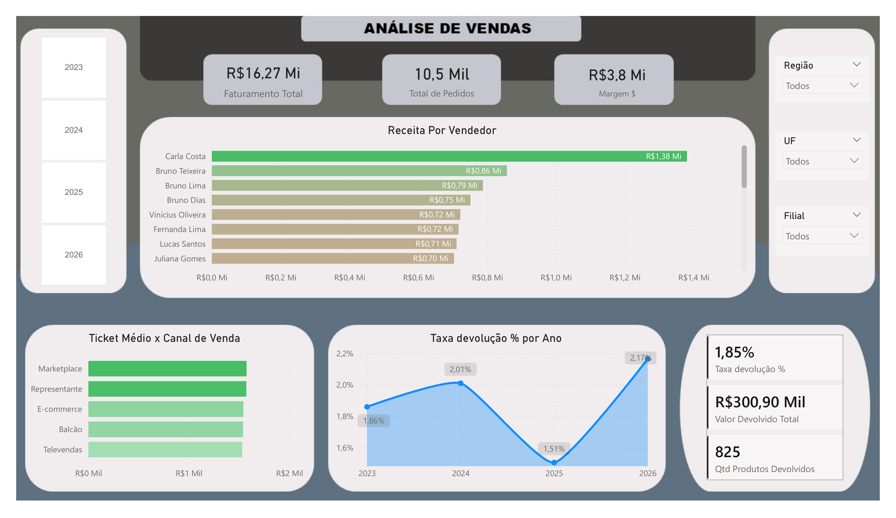
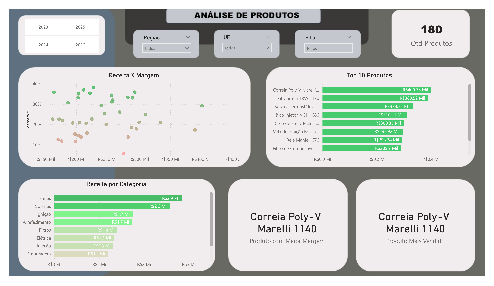
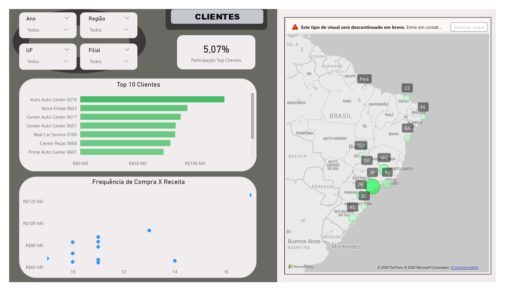
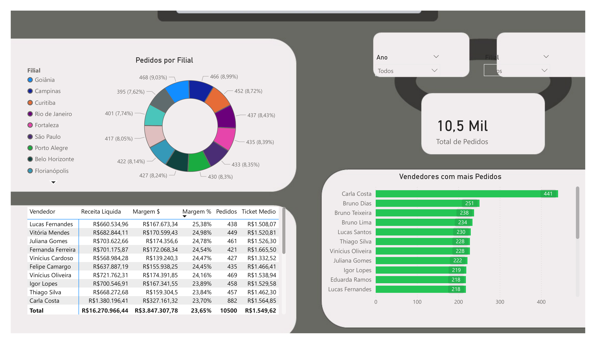

# 📊 Dashboard Comercial e Análise de Vendas | Power BI

Projeto de Business Intelligence desenvolvido no **Power BI** com foco na análise de desempenho comercial de uma empresa fictícia do segmento automotivo.

O dashboard foi construído a partir de uma base de dados estruturada em múltiplas tabelas relacionadas, permitindo analisar **vendas, pedidos, clientes, produtos, vendedores, filiais, margens, devoluções e desempenho comercial** em diferentes níveis de detalhe.

> **Objetivo:** transformar dados comerciais em uma visão executiva simples, interativa e orientada à tomada de decisão.

---

## 🛠️ Tecnologias e recursos utilizados

- **Power BI Desktop**
- **Power Query** para importação e preparação dos dados
- **Modelagem de dados** com relacionamento entre tabelas
- **DAX** para criação de medidas e indicadores
- Segmentações e filtros interativos
- Visualizações geográficas
- Excel como fonte de dados

---

# 📑 Páginas do Dashboard

## 1. Visão Executiva




---

## 2. Análise de Vendas




---

## 3. Análise de Produtos




---

## 4. Clientes




---

## 5. Performance Comercial




---

## 🔎 Possibilidades de análise

Com os filtros e relacionamentos do modelo é possível responder perguntas como:

- Quais filiais geram mais receita?
- Quais vendedores possuem melhor desempenho comercial?
- Quais produtos combinam alta receita e boa margem?
- Quais categorias representam maior participação no faturamento?
- Quais clientes concentram maior receita?
- Como a receita evolui ao longo dos meses e anos?
- Qual é o impacto das devoluções sobre o resultado comercial?
- Quais canais de venda possuem maior participação?

---

## 🎯 Competências demonstradas

Este projeto demonstra conhecimentos em:

- Construção de dashboards no Power BI
- Preparação e transformação de dados
- Modelagem relacional
- Criação de KPIs e medidas
- Análise exploratória de dados
- Visualização de dados
- Storytelling com dados
- Análise de vendas e performance comercial

---

## 📁 Arquivos do projeto

```text
├── Projeto Vendedora.pbix
├── README.md
└── Imagens/
    ├── 01_visao_executiva.png
    ├── 02_analise_vendas.png
    ├── 03_analise_produtos.png
    ├── 04_clientes.png
    └── 05_performance_comercial.png
```

---

